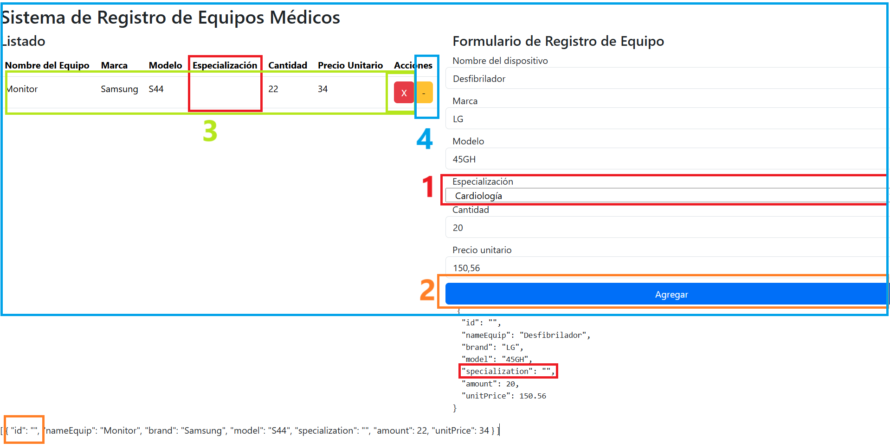

# Información del proyecto

Este proyecto esta construido con [Angular CLI](https://github.com/angular/angular-cli) version 19.0.2.

## DEV

1. Clonar el repositorio: ```git clone https://github.com/JheysonGaona/AppAngularMedicalEquipment.git```
2. Ejecutar desde directorio raiz: ```npm install```
3. Ejecutar la app: ```ng serve -o```


## TAREA A RESOLVER



1) Del formulario de registro de quipos médicos: hacer funcionar la lista desplegable de "Especialización"
	y que se refleje dentro del JSON.

2) Cuando se registre un nuevo equipo, se debe generar un "ID" de manera automática. Esto se debe reflejar
	dentro de la lista de equipos registrados del JSON.

3) Al eliminar un registro con el botón "X". Se debe eliminar unicamente el registro en función al "ID".

4) OPCIONAL:
* "Se debe poder actualizar el registro del equipo"
* Se debe utilizar estilos CSS personalizados o Bootstrap" para brindar una mejor experiencia de usuario.
